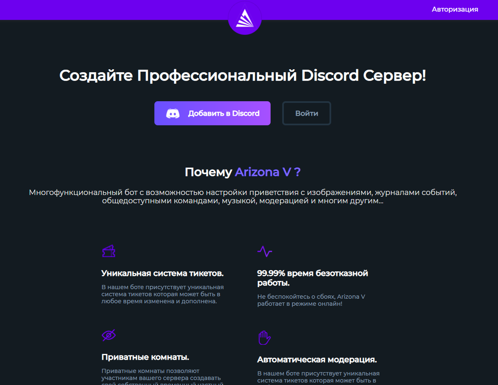

<h1 align="center">Landing page for Discord Bot</h1>

<h2 align="center"><a  href="https://olzx.github.io/Landing-page-for-Discord-Bot/">Демонстрация</a></h2>

## Описание
Разработанные и сверстанные по макету страницы для бота в дискорде
### Особенности:
- Адаптивная верстка с брейк поинтами;
- Выпадающее меню на телефонной версии (гамбургер);
     
### Доступно:
- Главная страница (index.html);
- Страница с выбором панели (authorized.html);